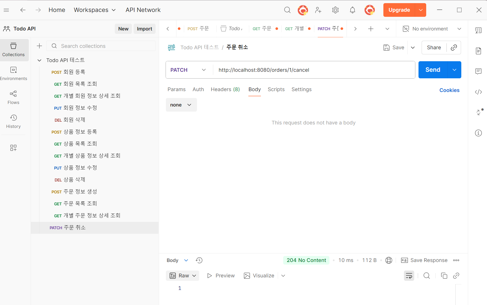

# Week 2

## 1. 학습 목표
2주차 스터디에서는 온라인 쇼핑몰 프로젝트의 핵심 기능 중 하나인 **회원, 상품, 주문 기능의 컨트롤러와 서비스 계층을 구현**하는 것을 목표로 하였다.  
1주차에서 설계한 API 명세서를 기반으로, 실제 요청이 처리되는 과정을 코드로 작성하고, Postman을 통해 API 테스트를 직접 수행하였다.

---

## 2. 학습 및 실습 내용

1. **회원(Member) 컨트롤러 및 서비스 구현**
    - 회원 등록, 전체 회원 조회, 단일 회원 조회, 회원 정보 수정, 회원 삭제 기능을 구현하였다.
    - `@RestController`, `@GetMapping`, `@PostMapping`, `@PutMapping`, `@DeleteMapping` 등을 사용하여 RESTful API를 구성하였다.
    - Postman을 이용해 API 호출을 테스트하고, 정상적인 CRUD 동작을 확인하였다.

2. **상품(Product) 컨트롤러 및 서비스 구현**
    - 상품 등록, 상품 목록 조회, 개별 상품 상세 조회, 상품 수정, 상품 삭제 기능을 구현하였다.
    - 실제 DB 연동 없이 메모리 저장소를 통해 로직을 구성하고, 각 기능의 흐름을 이해하는 데 집중하였다.

3. **주문(Order) 컨트롤러 및 서비스 구현**
    - 주문 생성, 주문 목록 조회, 개별 주문 조회, 주문 취소 기능을 구현하였다.
    - `@PatchMapping`을 통해 주문 상태를 변경(`CREATED → CANCELED`)하는 로직을 학습하였다.
    - Postman에서 `PATCH http://localhost:8080/orders/{id}/cancel` 요청을 통해 상태 변경이 제대로 동작하는 것을 확인하였다.

4. **Postman을 이용한 API 테스트**
    - 각 API의 요청 방식(Method), 경로(URL), 요청 바디(JSON), 응답 코드(Status Code)를 하나씩 확인하였다.
    - `200 OK`, `201 Created`, `204 No Content` 등의 응답 코드를 통해 요청이 정상 처리되는 것을 검증하였다.

---

## 3. 구현한 주요 API

### 👤 회원 기능
| 기능 | Method | URI |
|------|---------|------|
| 회원 등록 | POST | `/members` |
| 전체 회원 조회 | GET | `/members` |
| 개별 회원 조회 | GET | `/members/{id}` |
| 회원 정보 수정 | PUT | `/members/{id}` |
| 회원 삭제 | DELETE | `/members/{id}` |

---

### 🛍️ 상품 기능
| 기능 | Method | URI |
|------|---------|------|
| 상품 등록 | POST | `/products` |
| 상품 목록 조회 | GET | `/products` |
| 개별 상품 상세 조회 | GET | `/products/{id}` |
| 상품 수정 | PUT | `/products/{id}` |
| 상품 삭제 | DELETE | `/products/{id}` |

---

### 📦 주문 기능
| 기능 | Method | URI |
|------|---------|------|
| 주문 생성 | POST | `/orders` |
| 주문 목록 조회 | GET | `/orders` |
| 개별 주문 상세 조회 | GET | `/orders/{id}` |
| 주문 취소 | PATCH | `/orders/{id}/cancel` |

---

## 4. 느낀 점
이번 주차에서는 단순히 코드만 작성하는 것이 아니라,  
**컨트롤러 → 서비스 → Postman 테스트**로 이어지는 전체 흐름을 체계적으로 이해할 수 있었다.  
특히 `@RequestBody`, `@PathVariable` 등의 어노테이션이 어떤 역할을 하는지, 그리고 HTTP 메서드별 요청 목적이 왜 나뉘는지를 직접 체감할 수 있었다.

Postman을 통해 API를 테스트하면서 처음에는 `400 Bad Request`, `405 Method Not Allowed` 등의 에러를 자주 만났지만,  
오류 원인을 분석하고 수정하는 과정을 통해 **서버의 응답 구조와 RESTful 설계 방식**을 한층 더 명확하게 이해하게 되었다.  
다음 주차에서는 엔티티(Entity)와 레포지토리(Repository) 계층을 연동하여 실제 DB와의 연결을 경험해 보고 싶다.

---

## 5. 학습 사진

### 📸1 — Postman을 통한 Member 도메인 API 테스트 (선택)

