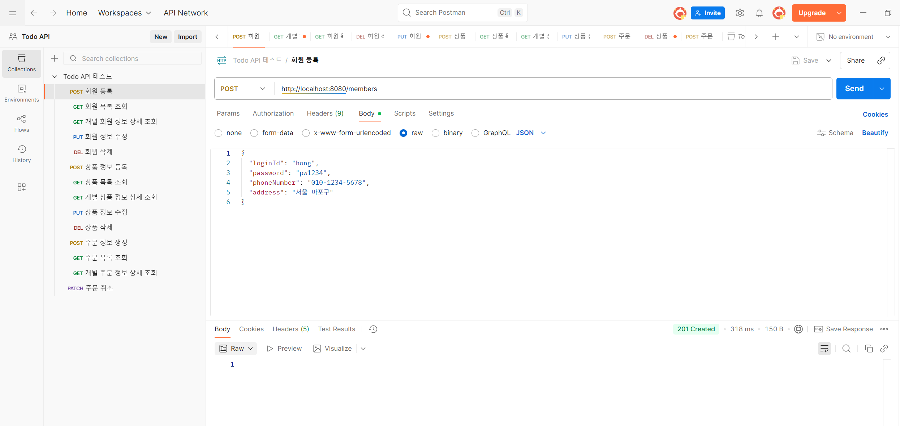
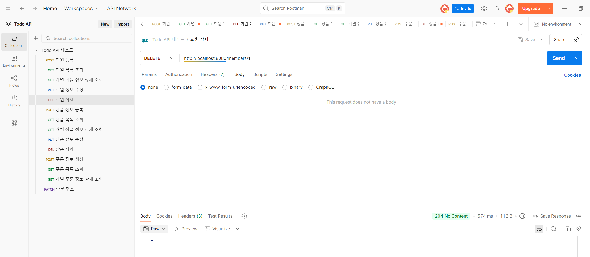
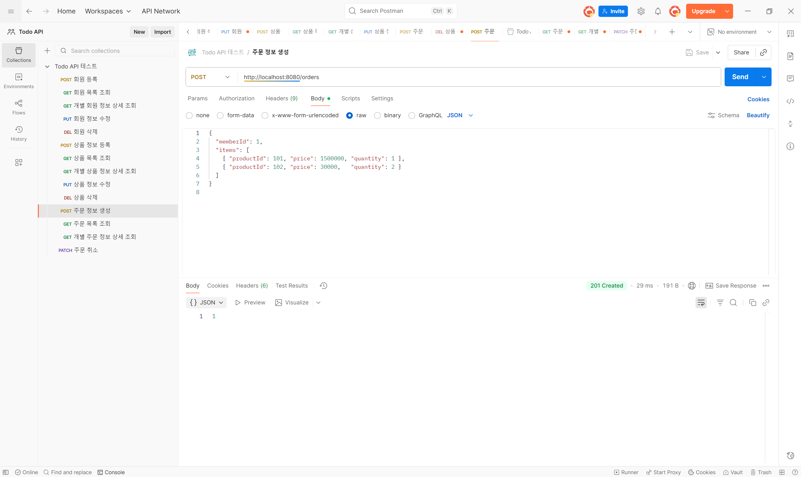

# Week 3

## 1. 학습 목표
3주차 스터디에서는 온라인 쇼핑몰 프로젝트의 **어드민(관리자) 영역 레포지토리 계층 구현**을 목표로 하였다.  
`Member`, `Product`, `Order` 도메인에 대해 **JPA 기반의 CRUD 기능을 레포지토리로 구현**하고,  
Postman을 이용해 실제 HTTP 요청으로 데이터가 잘 저장·조회되는지를 검증하였다.

1주차(설계)와 2주차(서비스·컨트롤러 구현)에서 학습한 내용을 바탕으로,  
이번 주는 **Repository 계층이 서비스 로직과 데이터베이스를 연결하는 역할**을 명확히 이해하는 데 초점을 맞추었다.

---

## 2. 학습 및 실습 내용

### 1️⃣ Member Repository 계층 구현
- `MemberRepository`를 `JpaRepository<Member, Long>`으로 구현하여  
  CRUD 기능을 자동으로 사용할 수 있도록 하였다.
- `MemberService`에서는 `memberRepository.save()`, `findAll()`, `findById()`, `deleteById()` 등을 호출하며  
  JPA의 기본 동작을 익혔다.
- Postman을 통해 회원 등록 → 조회 → 수정 → 삭제 순으로 테스트하며  
  응답 코드(`201`, `200`, `204`)를 통해 정상 동작 여부를 검증하였다.

### 2️⃣ Product Repository 계층 구현
- `ProductRepository`, `ProductService`, `ProductController`를 계층 구조로 구성하였다.
- 상품 등록, 전체 목록 조회, 개별 상품 상세 조회, 수정, 삭제 기능을 구현하였다.
- `ResponseStatusException`을 이용해 존재하지 않는 상품 접근 시 `404 Not Found` 예외를 반환하도록 처리하였다.
- Postman으로 `POST /products`, `GET /products`, `PUT /products/{id}` 요청을 테스트하며,  
  JPA와 REST API의 데이터 연동 과정을 체험하였다.

### 3️⃣ Order Repository 계층 구현
- `OrderRepository`를 추가하고, 주문 생성, 목록 조회, 상세 조회, 취소 기능을 구현하였다.
- 주문 상태는 `OrderStatus`(예: CREATED, CANCELED)로 관리하였다.
- `@PatchMapping`을 이용해 `PATCH /orders/{id}/cancel` 요청 시 주문 상태가 `CANCELED`로 변경되도록 구현하였다.
- Postman에서 `POST /orders` → `PATCH /orders/{id}/cancel` 흐름을 테스트하여  
  상태 변경이 정상 반영되는지 확인하였다.

### 4️⃣ Postman 테스트 과정
- 각 도메인별로 REST API를 순서대로 호출하며 CRUD 동작을 검증하였다.
- `GET`, `POST`, `PUT`, `DELETE`, `PATCH` 메서드의 역할 차이를 명확히 이해하였다.
- 특히 `405 Method Not Allowed`, `400 Bad Request`, `500 Internal Server Error` 등의 오류를 직접 해결하며  
  요청-응답 구조를 더욱 명확히 이해하였다.

---

## 3. 구현한 주요 API

### 👤 회원 기능
| 기능 | Method | URI          |
|------|---------|--------------|
| 회원 등록 | POST | `/members`   |
| 전체 회원 조회 | GET | `/members`   |
| 개별 회원 조회 | GET | `/members/1` |
| 회원 정보 수정 | PUT | `/members/1` |
| 회원 삭제 | DELETE | `/members/1` |

---

### 🛍️ 상품 기능
| 기능 | Method | URI           |
|------|---------|---------------|
| 상품 등록 | POST | `/products`   |
| 상품 목록 조회 | GET | `/products`   |
| 개별 상품 상세 조회 | GET | `/products/1` |
| 상품 수정 | PUT | `/products/1` |
| 상품 삭제 | DELETE | `/products/1` |

---

### 📦 주문 기능
| 기능 | Method | URI                |
|------|---------|--------------------|
| 주문 생성 | POST | `/orders`          |
| 주문 목록 조회 | GET | `/orders`          |
| 개별 주문 상세 조회 | GET | `/orders/1`        |
| 주문 취소 | PATCH | `/orders/1/cancel` |

---

## 4. 느낀 점
이번 주차에서는 **JPA Repository 계층이 실제 데이터 흐름의 중심이라는 점**을 실감했다.  
컨트롤러와 서비스에서 작성한 코드가 `JpaRepository`를 통해 데이터베이스에 매핑되고,  
Postman으로 직접 CRUD 요청을 보냈을 때 그 결과가 DB에 반영되는 것을 확인할 수 있었다.

또한 단순히 성공 응답을 받는 것뿐 아니라, 예외 처리를 통해 잘못된 요청에 대해 올바른 응답 코드를 반환하는 것이  
RESTful 설계에서 얼마나 중요한지도 배우게 되었다.

이번 과정을 통해 REST API의 전체 흐름과 JPA의 기본 동작 원리를 확실히 이해하였으며,  
다음 주차에서는 **엔티티 간 연관관계 매핑(@OneToMany, @ManyToOne)** 을 학습해  
회원–주문–상품 간 관계를 실제 DB 수준에서 완성해보고자 한다.

---

## 5. 학습 사진 (일부)

### 📸1 — Postman을 이용한 회원 등록 테스트

### 📸2 — Postman을 이용한 회원 삭제 테스트

### 📸3 — Postman을 이용한 주문 정보 생성 테스트

### 📸4 — Postman을 이용한 개별 주문 정보 상세 조회 테스트
