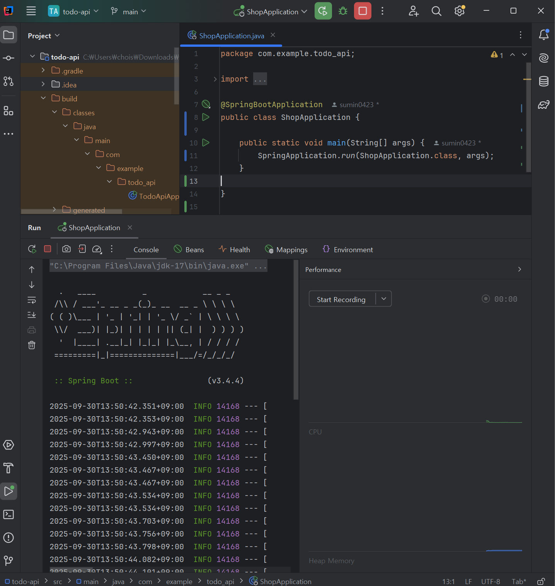
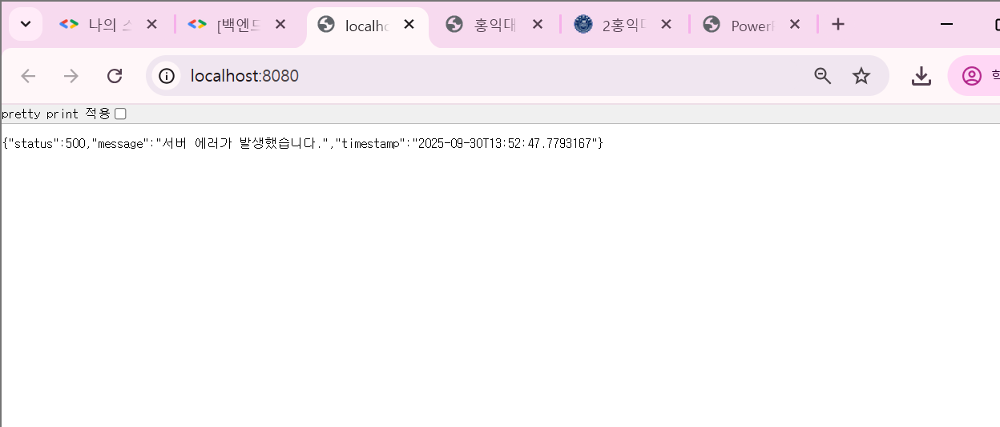

# Week 1

## 1. 학습 목표
1주차 스터디에서는 온라인 쇼핑몰 프로젝트를 시작하기 위한 기초 작업을 진행하였다. 그러기 위해서 가장 첫 번째 목표는 Spring Boot 개발 환경을 세팅하고 애플리케이션을 실행한 뒤, 프로젝트에서 사용할 API 명세서를 직접 설계하는 것이다.

---

## 2. 학습 및 실습 내용
1. **Spring Boot 개발 환경 세팅**
    - IntelliJ IDEA를 활용하여 프로젝트를 실행할 수 있도록 환경을 구축하였다.
    - Gradle을 이용해 필요한 의존성을 관리하고, 애플리케이션이 정상적으로 실행되는지 확인하였다.

2. **애플리케이션 실행**
    - 정상적으로 서버가 실행되는 것을 확인함으로써 이후 API 개발을 위한 기반을 마련하였다.

3. **온라인 쇼핑몰 프로젝트 API 명세서 설계**
    - 이번 스터디에서는 회원 기능을 제외한 **상품** 및 **주문** 기능에 대해 API를 설계하였다.
    - HTTP Method와 URI 중심으로 간단하게 정의하였다.

---

## 3. 온라인 쇼핑몰 API 명세서 (간단하게)

###  🛍️ 상품 기능
- **상품 등록**: `POST /api/products`
- **상품 목록 조회**: `GET /api/products`
- **상품 상세 조회**: `GET /api/products/{id}`
- **상품 수정**: `PUT /api/products/{id}`
- **상품 삭제**: `DELETE /api/products/{id}`

###  📦 주문 기능
- **주문 생성**: `POST /api/orders`
- **주문 목록 조회**: `GET /api/orders`
- **주문 상세 조회**: `GET /api/orders/{id}`
- **주문 취소**: `DELETE /api/orders/{id}`

---

## 4. 느낀 점
처음부터 환경 세팅 문제로 가장 많이 힘들었다. 프로젝트 경로가 꼬이거나 실행 파일 이름이 중복되어 오류가 발생했는데, 그 과정에서 단순한 실행조차도 많은 이해가 필요하다는 것을 깨달았다.
그렇게 해결하고 나서 마주한 API 명세서 작성은 처음에는 막연했지만, HTTP Method와 URI만으로도 기본적인 설계를 시작할 수 있다는 점을 배웠다. 이번 과정을 통해 단순하게 바라보았던 작은 설치나 실행 하나에도 원리를 이해하고 차근차근 접근해야 한다는 생각을 했다.
다음 주차에서는 이러한 부분들을 신경 쓰며 이번 주차보다는 더욱 집중하며 나아가야겠다.

## 5. 학습 사진
### 📸1

### 📸2

