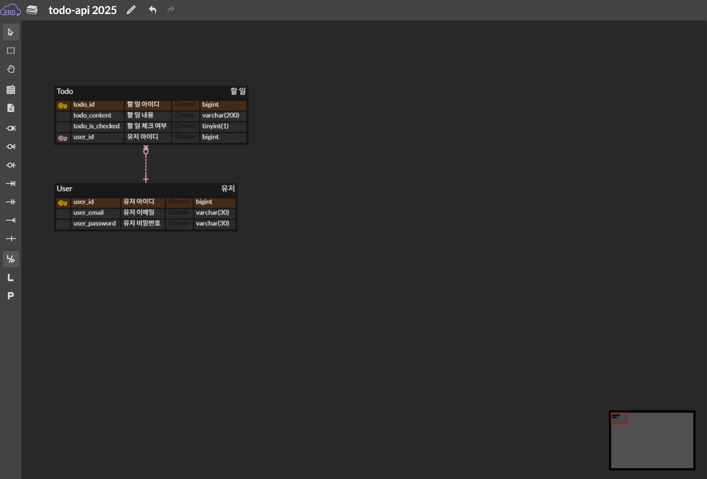
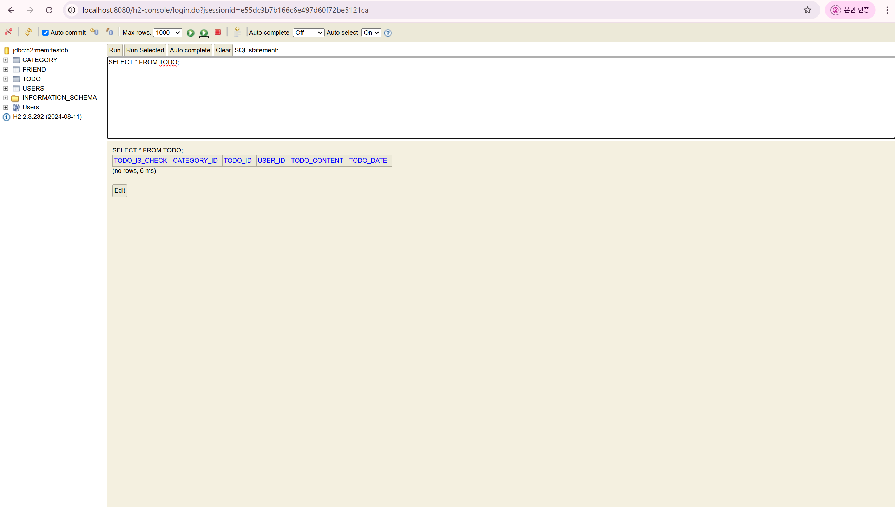

# ✅ 3주차 WIL

## 1. 3주차 학습 내용

Spring Boot 기반의 Todo 애플리케이션을 구축하면서, JPA를 통해 도메인 모델과 데이터베이스 간의 매핑 방식을 학습했다. 핵심적으로는 User, Todo, Category라는 세 가지 엔티티를 설계하고, 이들 간의 연관관계를 `@ManyToOne`, `@JoinColumn` 등을 통해 설정하였다. 또한 계층 분리 원칙에 따라 Repository, Service, Controller 구조로 나누어 각각의 역할을 분명히 구현하였다.

프로젝트의 실행 환경은 H2 인메모리 DB를 기반으로 구성하였고, `application.yml` 설정 파일을 통해 DDL 자동 생성 및 consol 접근을 가능하게 하였다. 이를 통해 객체 중심의 코드가 관계형 DB에서 어떤 식으로 표현되는지를 확인할 수 있었다.

## 2. 어려웠던 점과 해결 과정

처음에 `user`라는 테이블명을 그대로 사용하여 H2에서 SQL과 충돌하여 테이블 생성에 실패하는 오류가 발생했다. 이 문제는 `@Table(name = "users")`를 추가하여 테이블 이름을 변경함으로써 해결할 수 있었다.

또한 `@ManyToOne`으로 객체 간 관계를 맺을 때, 관련 엔티티가 서로 올바른 패키지에 존재하지 않거나, 패키지 간 import 경로가 틀릴 경우 스프링이 해당 엔티티를 인식하지 못하는 문제를 겪었다. 이는 패키지 구조를 정리하고, `@SpringBootApplication` 어노테이션의 위치가 상위 패키지에 위치하도록 조정함으로써 해결하였다.

그 외에도 application.yml에 데이터베이스 설정을 할 때 spring.jpa.hibernate.ddl-auto 옵션과 spring.h2.console.enabled 설정이 누락되어 콘솔 접속이 되지 않거나 테이블이 자동 생성되지 않는 문제가 있었는데, 이를 확인하고 설정을 명확히 추가하면서 문제를 해결했다.

## 3. 느낀 점

객체 간 관계를 어떻게 설정하고 유지할 것인지에 대한 고민이 필요하다는 점을 체감했다. 특히 JPA의 핵심 개념인 엔티티 매핑, 영속성 컨텍스트, LAZY 전략 등의 개념을 직접 구현하며 보다 깊이 이해할 수 있었다.

이번 스터디와 과제를 통해, 문제 해결을 단순히 구글링에 의존하기보다는 에러 메시지를 스스로 분석하고 과제 문서를 참고하며 에러를 줄여나가는 과정에서 뿌듯함과 흥미를 느꼈다.

## 4. 과제 사진

