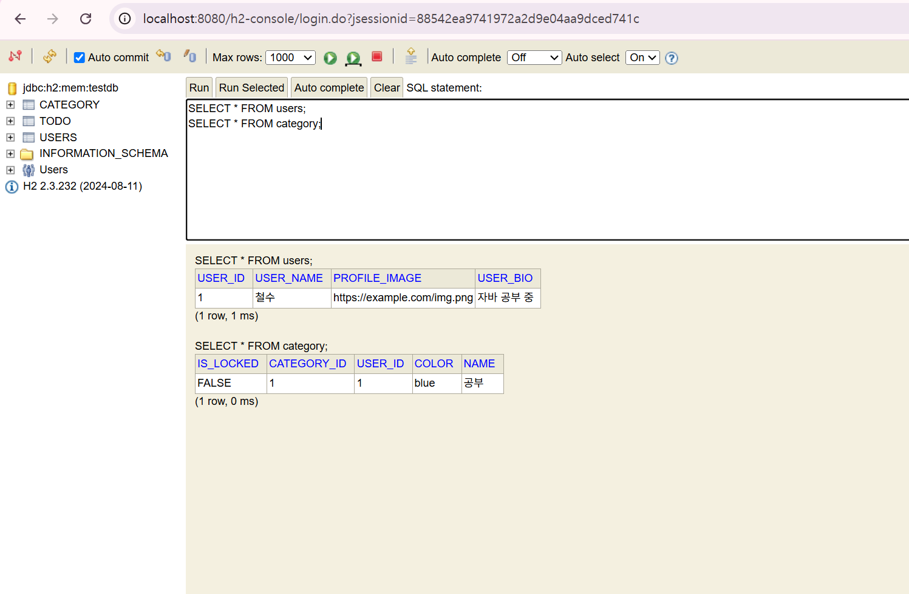
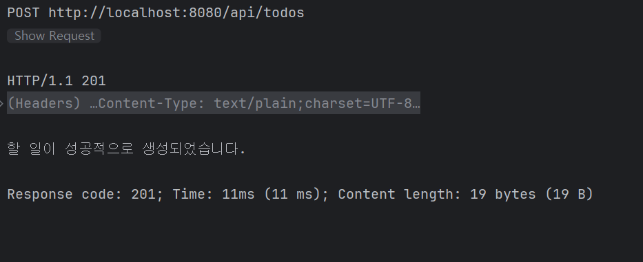

# ✅ 4주차 WIL

## 1. 학습 내용

이번 주차에는 스프링 부트와 JPA를 활용해 실제 데이터베이스와 연결하고, 데이터를 저장하거나 불러오고 수정하고 삭제하는 기능을 구현해보았다. 이를 위해 데이터 처리 흐름에서 레포지토리 계층이 어떤 역할을 하는지, 그리고 트랜잭션과 영속성 컨텍스트 같은 개념이 코드에 어떻게 작용하는지를 살펴보았다.

## 2. 주요 개념

- **레포지토리 계층**: 데이터베이스와 직접 연결되어 데이터를 처리하는 부분이다. 서비스 계층은 이 레포지토리를 이용해 데이터에 접근하거나 조작하는 작업을 진행한다.
- **엔티티 매니저**: 데이터베이스에 값을 저장하거나 조회, 삭제할 때 사용하는 도구로, 설정 파일에서 관련 설정을 지정해 사용할 수 있다.
- **트랜잭션**: 여러 작업을 하나로 묶어 실행하며, 도중에 문제가 생기면 전체를 되돌리는 방식으로 데이터의 안정성을 유지한다.
- **영속성 컨텍스트**: DB에 반영되기 전까지 엔티티 객체들을 보관하고 추적하는 공간이다. 같은 데이터를 중복해서 불러오는 일이 줄고, 변경 사항이 효율적으로 관리된다.

## 3. 실습 내용

- `TodoRepository` 인터페이스를 만들고, JPA를 통해 자동으로 기능이 구현되도록 설정했다.
- 엔티티 매니저를 사용해 데이터를 저장하거나 불러오고, 삭제하는 작업을 직접 수행해보았다.
- 테스트 클래스에서는 트랜잭션 관련 어노테이션을 사용해 실제 데이터베이스에 반영되는 상황을 확인했다.
- JPQL을 사용해 조건에 맞는 데이터를 조회하는 코드도 작성해보았다.

## 4. 느낀 점

POST 요청 시 500 오류가 발생했는데, 단순한 요청 문제가 아니라 Todo 객체 생성 시 User와 Category를 제대로 조회해 연결하지 않아 생긴 문제였다. 또한 @Builder 사용 시 생성자 설정이 맞지 않아 객체 생성에 실패했고, 이를 수정하며 setDate() 메서드를 따로 사용하는 방식으로 개선했다. H2 메모리 DB의 특성상 애플리케이션 종료 시 데이터가 초기화된다는 점도 이번 과정을 통해 알게 되었다. 이번 과정을 통해 단순한 에러 메시지 뒤에 있는 실제 원인을 파악하는 연습을 할 수 있었다.
직접 로그를 보고 문제의 위치를 찾아 수정하는 과정을 통해 문제 해결 능력이 조금씩 향상되고 있다고 느꼈다. 마지막에 정상적으로 할 일을 생성했을 때의 순간은 정말 뿌듯했고, 노력한 시간이 헛되지 않았다는 생각이 들었다.

## 5. 과제 사진

### 1. H2 콘솔에서 확인된 users와 category 테이블

### 2. POST 요청 후 성공 응답

