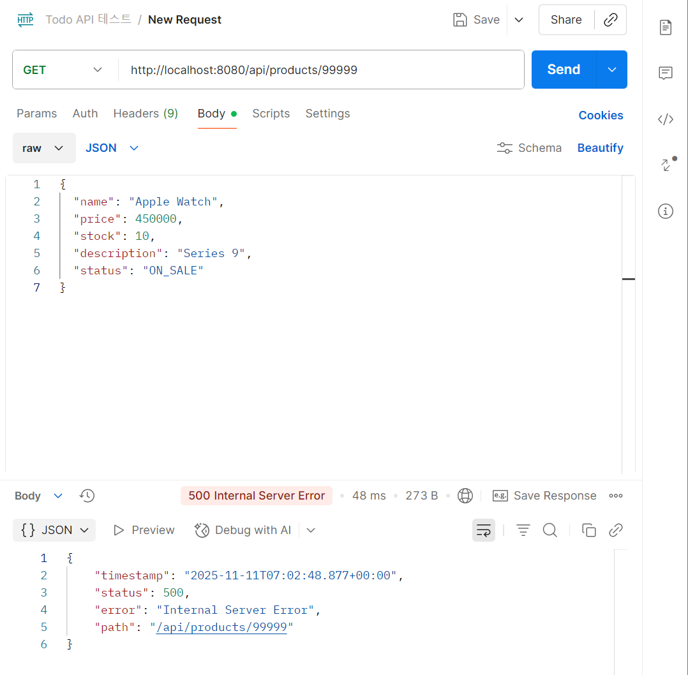

# Week 4

## 1. 학습 목표
4주차 스터디에서는 온라인 쇼핑몰 프로젝트의 **엔티티 간 연관관계 매핑과 데이터 흐름 이해**를 목표로 하였다.  
`Member`, `Product`, `Orders`, `OrderItem` 엔티티를 중심으로 ERD를 설계하고,  
`EntityManager`를 이용해 CRUD 기능을 직접 구현하면서 JPA의 동작 원리를 체험하였다.

이번 주는 단순히 코드가 “돌아가는 것”에 그치지 않고,  
**데이터가 어떻게 흘러가며 어디서 관리되는지를 스스로 눈으로 확인하고 이해하는 것**에 초점을 맞추었다.

---

## 2. 학습 및 실습 내용

### 1️⃣ ERD 설계
- 처음에는 ERDCloud를 이용하려 했으나, 다이어그램이 생성되지 않는 오류가 발생했다.  
  대신 `dbdiagram.io`를 활용해 정상적으로 ERD를 완성했다.
- `Member`, `Product`, `Orders`, `OrderItem` 간 관계를 다음과 같이 정의하였다.
    - `Member` 1 ↔ N `Orders`
    - `Orders` 1 ↔ N `OrderItem`
    - `Product` 1 ↔ N `OrderItem`
- ERD를 작성하면서 **엔티티 간 관계가 실제 데이터베이스 수준에서 어떻게 표현되는지**를 명확히 이해할 수 있었다.  
  특히, 단순히 코드 상의 어노테이션이 아니라, 외래키 제약과 테이블 간 연결 구조로 시각화되니 훨씬 직관적이었다.

---

### 2️⃣ EntityManager를 이용한 Product CRUD 구현
- 이번 주는 `JpaRepository`를 사용하지 않고, **`EntityManager`를 직접 활용**하여 CRUD 기능을 구현했다.  
  처음엔 `persist`, `find`, `merge`, `remove`가 낯설었지만,  
  JPA 내부에서 실제로 어떤 SQL이 실행되는지 로그를 통해 확인하면서 **영속성 컨텍스트의 개념**을 체감했다.
- 한 번 조회한 엔티티를 수정하면, 별도의 `save()` 없이도 자동으로 변경이 반영되는 것을 보며  
  “JPA가 객체의 상태를 추적한다”는 말의 의미를 명확히 이해할 수 있었다.
- 이를 통해 단순히 CRUD를 사용하는 수준에서 벗어나,  
  **JPA가 데이터를 어떻게 관리하고 동기화하는지**에 대한 감을 잡을 수 있었다.

---

### 3️⃣ H2 콘솔을 통한 검증
- 서버를 실행한 뒤 `http://localhost:8080/h2-console`에 접속하여  
  `SELECT * FROM MEMBER;`를 실행하였다.
- Postman으로 등록한 상품이 H2 DB에 실제로 반영되어 있는 것을 확인했고,  
  이는 `EntityManager`를 통해 데이터가 올바르게 영속화되었음을 보여주는 결과였다.
- 콘솔에서 직접 데이터를 확인하면서 **“내 코드가 데이터베이스와 연결되어 있다는 확신”**을 가질 수 있었다.

---

### 4️⃣ Postman 테스트
- **성공 케이스:**  
  `POST /api/products` 요청으로 상품을 등록했을 때 `201 Created` 응답을 받았다.  
  등록된 상품이 H2 콘솔에서도 동일하게 조회되었다.
- **실패 케이스:**  
  `GET /api/products/99999` 요청 시 존재하지 않는 ID에 대해 `404 Not Found` 응답이 반환되었다.
- 전역 예외 처리(`@RestControllerAdvice`)를 적용해,  
  예외 상황에서도 일관된 형식의 응답이 내려가도록 구현하였다.
- 이 과정을 통해 단순히 API가 작동하는지 확인하는 단계를 넘어,  
  **RESTful한 예외 처리와 응답 구조의 중요성**을 실감했다.

---

## 3. 구현한 주요 API

### 🛍️ 상품 기능
| 기능 | Method | URI |
|------|---------|-----|
| 상품 등록 | POST | `/api/products` |
| 전체 상품 조회 | GET | `/api/products` |
| 개별 상품 조회 | GET | `/api/products/{id}` |
| 상품 수정 | PUT | `/api/products/{id}` |
| 상품 삭제 | DELETE | `/api/products/{id}` |

---

## 4. 느낀 점
이번 주차는 확실히 지난주보다 어려웠던 것 같다.
`EntityManager`를 직접 쓰는 게 처음이라, 처음엔 왜 데이터가 안 저장되는지 이해가 안 됐고,  
H2 콘솔에서도 테이블이 안 보여서 한참 헤맸다.  
하지만 여러 번 시도하다 보니 결국 원리를 알게 됐다.  
JPA가 단순히 DB에 값을 넣는 게 아니라, **엔티티의 상태를 추적하고 반영하는 구조**라는 걸 직접 느꼈다.

ERD를 그리면서는 객체 간의 관계가 단순히 어노테이션으로 끝나는 게 아니라  
실제 데이터베이스에서는 외래키와 제약 조건으로 표현된다는 걸 알았다.  
이전에는 “그냥 @ManyToOne 붙이면 되는구나” 정도로만 생각했는데,  
이번에는 그 의미를 이해하고 쓰게 된 것 같다.

Postman과 H2 콘솔을 오가며 테스트할 때는 조금 복잡해보여서 하기 싫기도도 했지만,  
요청부터 응답, 그리고 DB 반영까지의 흐름을 눈으로 보니까 전체 구조가 한눈에 들어왔다.  
단순히 돌아가는 코드가 아니라, **이 코드가 왜 이렇게 동작하는지**를 알게 되어 뿌듯하다.

---

## 5. 학습 사진 (일부)

### 📸1 — H2 콘솔에서 PRODUCT 테이블 조회

### 📸2 — ERD 설계 (dbdiagram.io)

### 📸3 — Postman 성공 요청 (상품 등록)

### 📸4 — Postman 실패 요청 (존재하지 않는 상품 조회)
