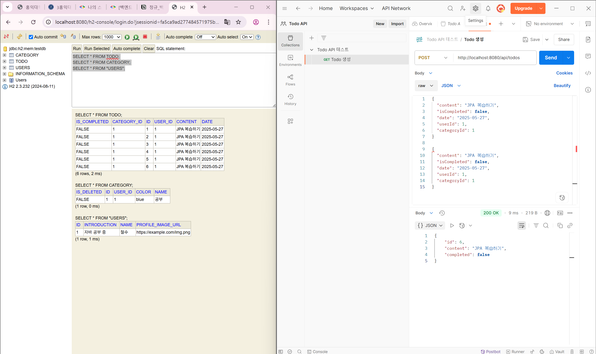

# Week 5

## 1. 학습 목표
5주차 스터디에서는 온라인 쇼핑몰 프로젝트에 **SOLID 원칙을 적용해 코드 구조를 개선하는 것**을 목표로 했다.  
특히 레포지토리 계층을 인터페이스와 구현체로 분리하고, 서비스가 특정 기술(JPA, 메모리 저장소)에 직접 의존하지 않도록 **DIP(의존성 역전 원칙)** 중심으로 리팩터링하는 데 집중하였다.

---

## 2. 학습 및 실습 내용

### 1️⃣ SOLID 원칙 적용
- **SRP**: 서비스는 비즈니스 로직만 담당하고, 데이터 저장은 레포지토리가 담당하도록 책임을 분리했다.
- **OCP**: JPA, 메모리 저장소 등 구현체를 자유롭게 교체할 수 있도록 인터페이스 기반 구조로 변경.
- **LSP**: 서비스가 JPA로 구현되든 메모리로 구현되든 동일하게 동작하도록 인터페이스 규약 유지.
- **ISP**: 레포지토리에 필요한 최소한의 CRUD 메서드만 선언.
- **DIP**: 서비스는 구체 클래스를 보지 않고 **MemberRepository**, **ProductRepository** 같은 추상화에만 의존하도록 설계.

---

### 2️⃣ Member 도메인 리팩터링
- `MemberRepository` 인터페이스 생성.
- 강의에서 제공된 `MemoryMemberRepository`를 구현체로 추가하여  
  저장 방식(JPA/메모리)을 쉽게 교체할 수 있는 구조 완성.
- 서비스는 저장 방식이 무엇인지 몰라도 되고, 오직 Repository를 통해서만 데이터에 접근하도록 변경.

---

### 3️⃣ Product 도메인 리팩터링
- 기존 서비스가 `EntityManager`까지 직접 다루던 구조에서 벗어나  
  **ProductRepository → ProductJpaRepository** 구조로 변경.
- `ProductService`는 ProductRepository만 바라보도록 단순화.
- 전체 요청 흐름이 “Controller → Service → Repository → DB” 로 명확히 정리되었다.

---

### 4️⃣ IoC/DI 적용 확인
- `@Repository`, `@Service`, `@RestController`를 통해  
  스프링이 필요한 객체를 자동으로 생성하고 주입해 주는 과정을 확인했다.
- 실행 로그로 “어떤 구현체가 주입되었는지” 확인하며 IoC 개념을 실감할 수 있었다.

---

## 3. 느낀 점
이번 주는 단순히 기능을 만드는 것을 넘어서, **코드를 구조적으로 잘 설계하는 것이 왜 중요한지**를 느낀 시간이었다.  
처음에는 레포지토리를 인터페이스로 분리하고 구현체를 따로 만드는 과정이 복잡하고 어렵게만 느껴졌던 것 같다.
특히 어떤 구현체가 주입되는지 설정이 꼬였을 때 에러 로그를 읽는 게 가장 힘들었다.  
하지만 리팩터링을 마친 뒤 코드를 보면, 서비스가 훨씬 깔끔해지고 전체 구조가 명확해졌다.  
“JPA로 바꿀 때 서비스는 수정할 필요가 없다”는 것이 실제로 가능해지는 걸 보면서  
**확장에는 열려 있고 변경에는 닫힌 구조**가 어떤 개념인지 이해하게 되었다.  
아직 SOLID 원칙이 완전히 익숙하진 않지만, 확실히 코드 품질이 좋아지는 느낌은 있어서 꾸준히 배우며 계속 적용해 보고 싶다.

---

## 4. 학습 사진 (일부)

### 📸1 — Product 도메인 SOILD 원칙 적용 결과

