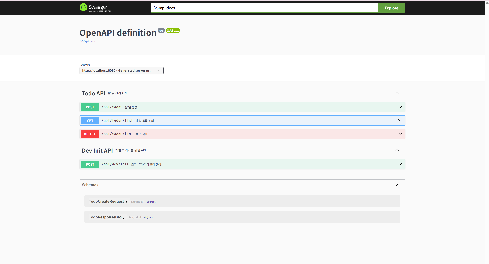
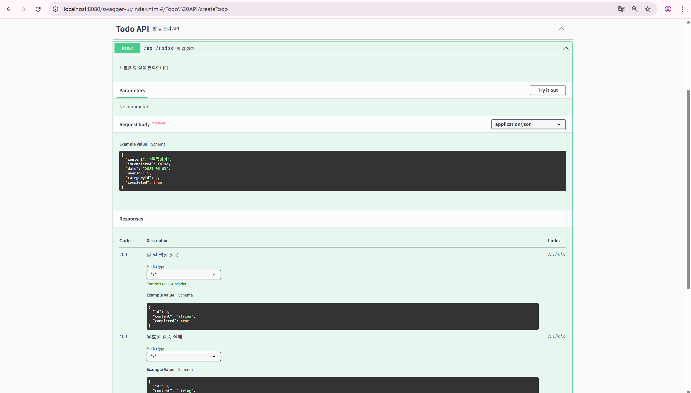
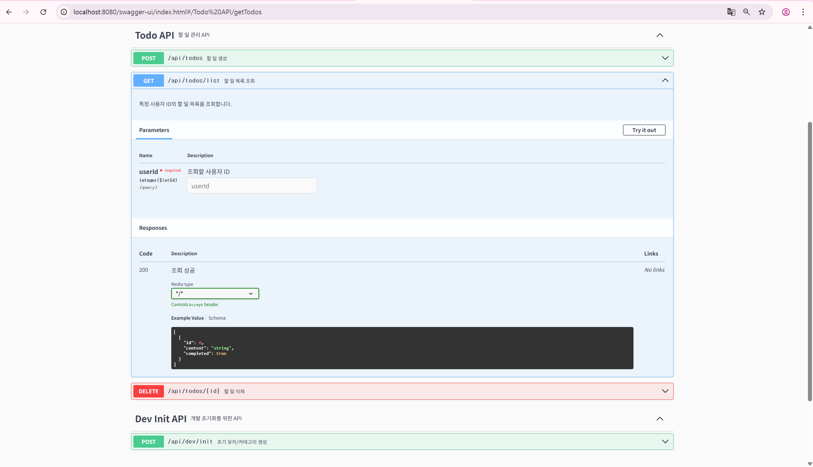
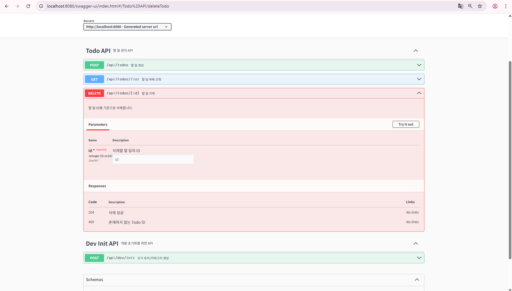
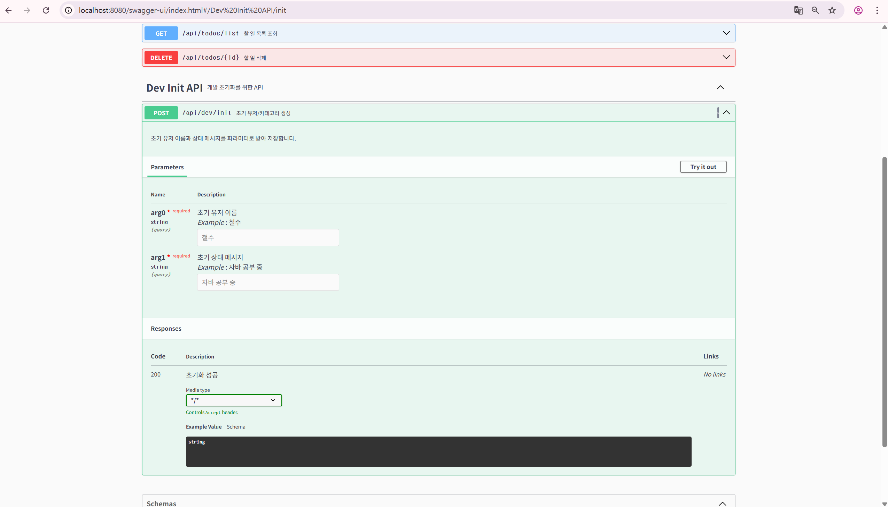
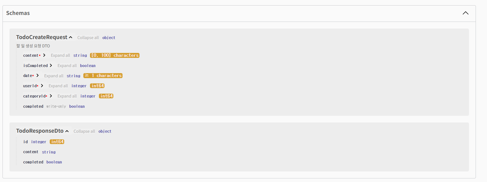

# ✅ 6주차 WIL

## 1. 학습 내용
이번 주차에는 Todo API에 유효성 검사 기능을 추가하고, **전역 예외 처리(GlobalExceptionHandler)**를 통해 오류를 일관되게 처리할 수 있도록 개선하였다. 또한 에러 메시지를 상수로 분리하여 관리하고, Swagger를 활용해 API 문서를 자동화하는 작업까지 수행하였다.

이 과정을 통해 서버 개발에서 필수적인 검증, 예외 관리, 문서화가 실제 서비스 개발에 어떤 식으로 통합되는지를 체계적으로 익힐 수 있었다.

## 2. 주요 개념
- **유효성 검사(@Valid)**: @NotBlank, @NotNull, @Size 등을 활용해 클라이언트로부터 들어오는 요청 값을 서버에서 검증하였다.

- **GlobalExceptionHandler**: 예외 발생 시 공통적으로 처리할 수 있도록 @RestControllerAdvice를 이용해 전역 예외 처리기를 구성하였다.

- **ErrorMessage 상수화**: 에러 메시지를 ErrorMessage.java 클래스에 상수로 정의하여 중복 없이 관리 가능하도록 리팩토링하였다.

- **Swagger(OpenAPI)**: springdoc-openapi 라이브러리를 적용하고 @Operation, @ApiResponses, @Parameter 등의 어노테이션을 통해 API 문서를 자동화하였다.

## 3. 실습 내용
이번 실습에서는 Todo 생성 요청의 정확도를 높이기 위해 DTO 클래스에 유효성 검사 어노테이션을 적용하였다.
@NotBlank, @NotNull, @Size 등을 활용하여 필수 값이 빠졌거나 형식이 맞지 않는 경우 서버에서 요청을 차단하도록 설정하였다.
이 과정을 통해 잘못된 데이터가 서버에 도달했을 때도 안정적으로 처리할 수 있는 구조를 만들 수 있었다.

또한, 유효성 검사에서 발생하는 예외는 GlobalExceptionHandler를 통해 한 곳에서 처리하도록 구성하였다.
특히 MethodArgumentNotValidException을 잡아 공통된 형식의 에러 응답을 만들었고,
어떤 필드에서 어떤 문제가 발생했는지 구체적인 메시지를 포함시켜 디버깅과 테스트가 더 수월해졌다.

서비스 계층에서는 에러 메시지를 하드코딩하지 않고, ErrorMessage라는 별도 클래스를 만들어 상수로 관리하도록 리팩토링하였다.
이 덕분에 메시지를 한 곳에서 통일되게 관리할 수 있었고, 중복도 줄일 수 있어서 코드 유지보수에도 도움이 되었다.

마지막으로 Swagger(OpenAPI)를 적용하여 API 명세를 자동으로 문서화하였다.
@Operation, @ApiResponse, @Parameter, @Schema와 같은 어노테이션을 사용해 요청 형식이나 응답 내용을 명시적으로 표현했고,
Swagger UI를 통해 API를 직접 테스트하고 확인할 수 있었다.
이 과정을 통해 API의 구조를 눈으로 쉽게 파악할 수 있었고, 실제 개발 과정에서도 문서화의 중요성을 체감할 수 있었다.

## 4. 느낀 점
이번 실습에서 가장 기억에 남는 부분은 예외를 통합적으로 처리하는 방식과 Swagger를 활용한 API 문서화였다.
처음에는 단순히 @NotNull이나 @NotBlank만 붙이면 되는 줄 알았지만, 실제로 잘못된 요청이 왔을 때 그 내용을 어떻게 응답할 것인지까지 고민해야 한다는 것을 깨달았다.

GlobalExceptionHandler 설정은 처음엔 생소했지만, 예외를 통일된 형식으로 처리하고 어떤 필드에서 어떤 문제가 발생했는지를 명확하게 전달할 수 있어 실무에서도 꼭 필요한 기능이라는 걸 느꼈다.

ErrorMessage 클래스를 따로 만들어 에러 메시지를 상수로 관리했을 때는, 처음엔 번거롭다고 느꼈지만 중복을 줄이고 메시지를 한 곳에서 관리할 수 있어서 유지보수가 훨씬 쉬워졌다.

Swagger도 단순히 UI만 예쁜 툴인 줄 알았는데, 직접 API를 테스트해보고 문서처럼 활용할 수 있다는 점에서 큰 도움이 되었다. Postman 없이도 바로 확인할 수 있고, 앞으로 협업을 하게 될 때도 아주 유용할 것 같다.

이번 스터디 전체를 돌아보면, 단순한 기능 구현을 넘어 API의 신뢰성과 안정성, 그리고 문서화와 예외 처리까지 고려한 개발의 중요성을 많이 배울 수 있었다. 처음에는 익숙하지 않은 개념들과 도구들에 조금 막막했지만, 실습을 반복하면서 점점 감을 잡아갔고, 마지막 과제까지 무사히 마치면서 성장한 느낌이 들어 뿌듯하다.

이번 백엔드 스터디를 통해 단순한 웹 개발이 아닌, 실제 서비스를 만드는 과정과 사고방식을 배울 수 있어서 정말 의미 있었다. 앞으로도 이 경험을 바탕으로 더 단단한 개발자가 되기 위해 노력해야겠다.

## 5. 과제 사진
### (1) Swagger로 문서화된 API 화면

### (2) Todo 생성 API 문서 구조 설명 (POST)

### (3) Todo 생성 API 문서 구조 설명 (GET)

### (4) Todo 생성 API 문서 구조 설명 (DELETE)

### (5) Dev Init 생성 API 문서 구조 설명 (POST)

### (6) TodoCreateRequest 및 TodoResponseDto 스키마 구조 (Swagger 자동 문서화)

